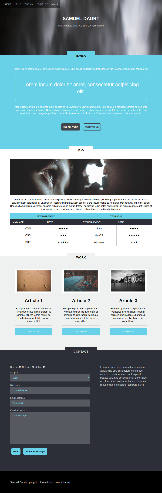

# Intégration Portfolio

Les consignes sont assez sommaires :

- Faire cette intégration, basée sur une seule capture écran (ouvrez l'image sous VScode pour la voir à 100%).
- La plupart des connaissances vues en saison HTML/CSS vous seront utiles.
- Commencez par la structure HTML, puis les règles CSS.
- Ne traitez pas forcément tout d'un coup, dégrossissez les éléments principaux, puis faites des allers-retours entre HTML et CSS si besoin pour peaufiner les détails.
- Pensez à utiliser les images libres de droit utilisées dans le challenge "Page perso" (ou [dummyimage](https://dummyimage.com/)).

Bon courage :muscle: !

